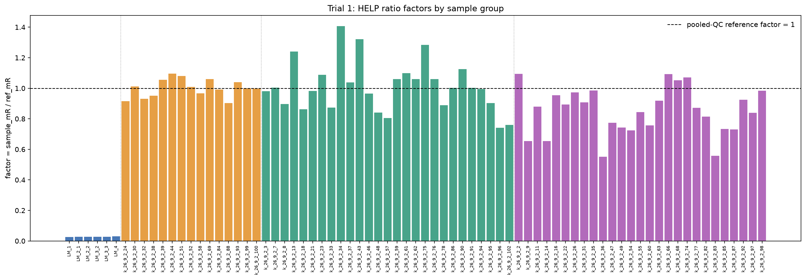
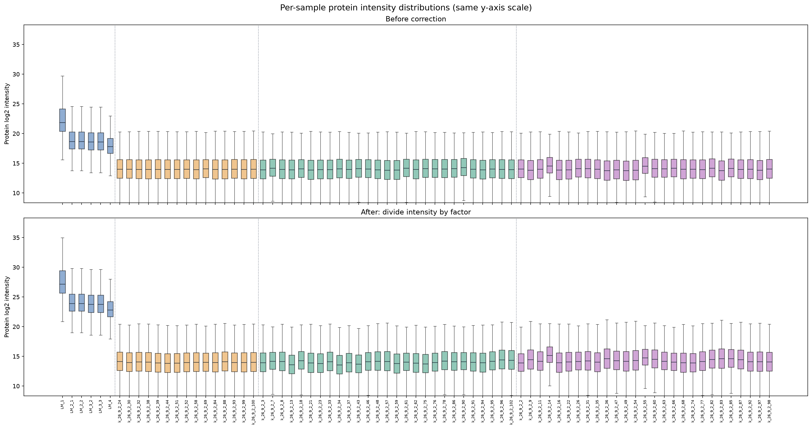
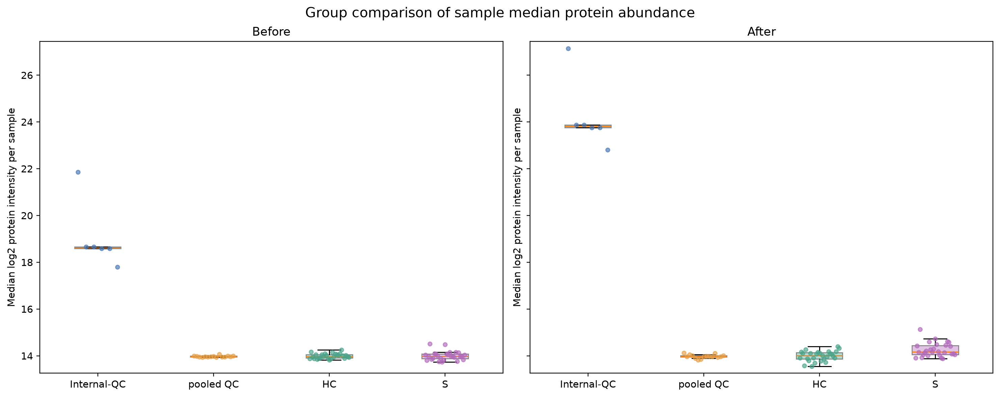
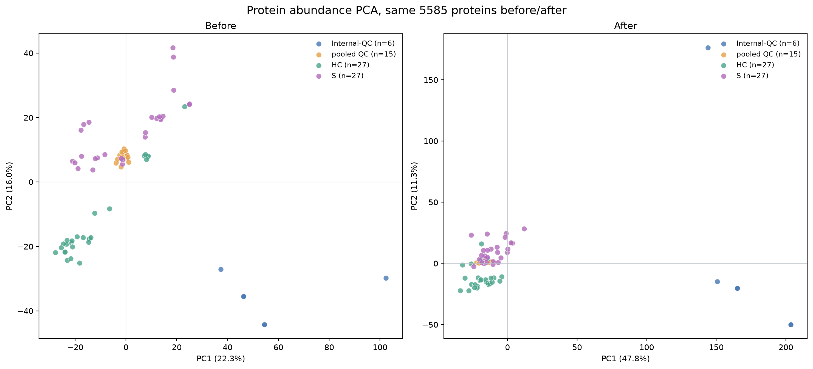
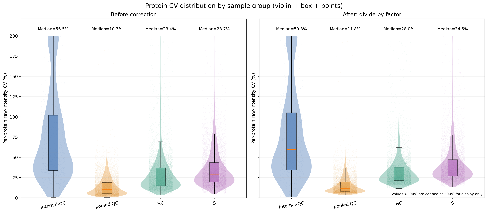

# PACS Trial 1 — 97 HELP median L/H-ratio factor

This is an exploratory, **unvalidated** factor correction, not a recommended final PACS method.
Original pg_matrix.tsv and HELP/metadata input files are NOT modified.

## Definition

For sample s, sample_mR = median of 97 HELP raw L/H ratios (excluding missing/nonpositive).
ref_mR = median of the 15 pooled QC sample_mR values (each QC has one median).
factor_s = sample_mR / ref_mR.
**Applied correction: protein corrected intensity = original intensity / factor_s.**
Thus applied multiplier = ref_mR / sample_mR. This assumes a higher HELP L/H
ratio indicates higher multiplicative protein intensity bias. This direction
cannot be proven from L/H ratios alone (e.g., H-driven drift would break it).
No HC, S or Internal-QC values contribute to ref_mR.

## Data and assumptions

- HELP: 97 sequences, raw ratio_LH sheet; medians taken on raw ratio values, not log2.
- Protein matrix: 5 annotation columns plus exactly 75 metadata-matched samples.
- Protein Group rows: 6830; all rows (human + yeast) retained.
- Groups: Internal-QC n=6; pooled QC n=15; HC n=27; S n=27.
- Intentional duplicated Internal-QC pairs retained as given; not 6 independent values.
- No factor fitting to protein data, no biological-group-based factor selection.
- Missing protein intensities stay missing; zero stays zero.
- CV uses detected finite positive raw intensities; no log-transform or imputation.
- CV requires detected n >= max(3, ceil(0.70*n_group)) and mean >= 1e-8;
  sample SD (ddof=1) / mean * 100, matching the reference R CV rule.
- CV of HC/S may include biological variation, not solely technical noise.
- PCA uses log2 positive intensities; >=70% overall detection filter.
- For PCA **only**, remaining missing log2 values are imputed with per-protein
  median within each stage; identical selected features before/after; features
  are mean-centered, not z-score standardized; samples are PCA observations.
- PCA features used: 5585. Before PC1/PC2: 22.3%/16.0%; after: 47.8%/11.3%.
- ref_mR = 0.01937029704; median pooled QC factor = 1.

## Group-wise per-protein CV

| Group | n | Eligible protein groups | Median CV before | Median CV after | Median paired CV change (percentage points) | Proteins with lower CV after |
| --- | ---: | ---: | ---: | ---: | ---: | ---: |
| Internal-QC | 6 | 672 | 56.51% | 59.79% | +2.74 | 15.5% |
| pooled QC | 15 | 5966 | 10.33% | 11.83% | +1.80 | 21.5% |
| HC | 27 | 5581 | 23.35% | 28.00% | +4.32 | 25.7% |
| S | 27 | 5822 | 28.71% | 34.48% | +5.76 | 20.6% |

## Figures

Group colors throughout: Internal-QC blue, pooled QC orange, HC green, S purple.

Figures are saved in PNG and SVG formats.

## Data files

- normalization_factors.csv: all sample medians, common pooled QC reference,
  factor, actual applied multiplier and log2 factor.
- pg_matrix_corrected.tsv: protein intensities divided by each sample factor.
- sample_protein_medians.csv: before/after per-sample median log2 protein intensity.
- pca_scores.csv: sample PCA coordinates and variance percentages.
- per_protein_cv.csv: each protein-group row × group, before/after raw-intensity CV.
- group_cv_summary.csv: four-group protein CV comparison.
- scripts/pacs_trial1.py: reproducible calculation and plots.
- .github/workflows/pacs-trial1.yml: auto-regenerate on input/script changes.

## Interpretation warning

A shift in median CV or PCA is descriptive; this does not establish whether
HELP ratio tracks protein abundance drift or whether signal should instead
be multiplied, left unmodified, or modeled in other ways. Use pooled-QC
repeatability, yeast spike-in controls and biological-group preservation
to judge any future PACS method.
