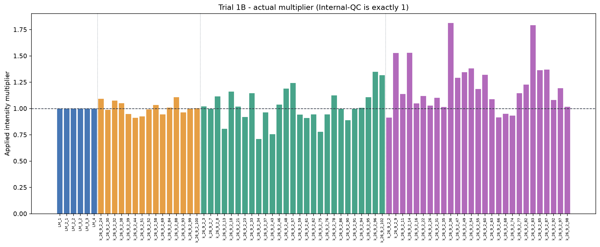
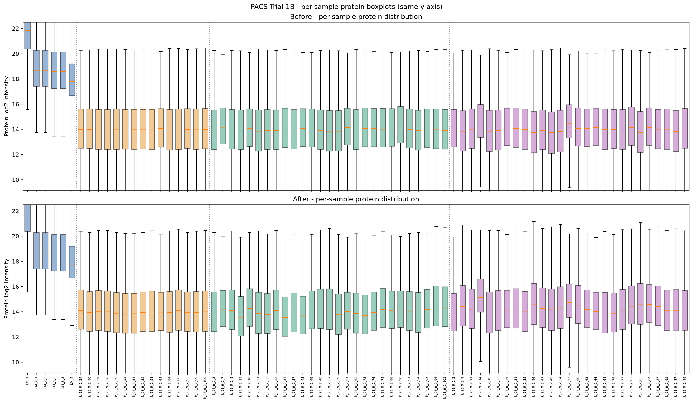
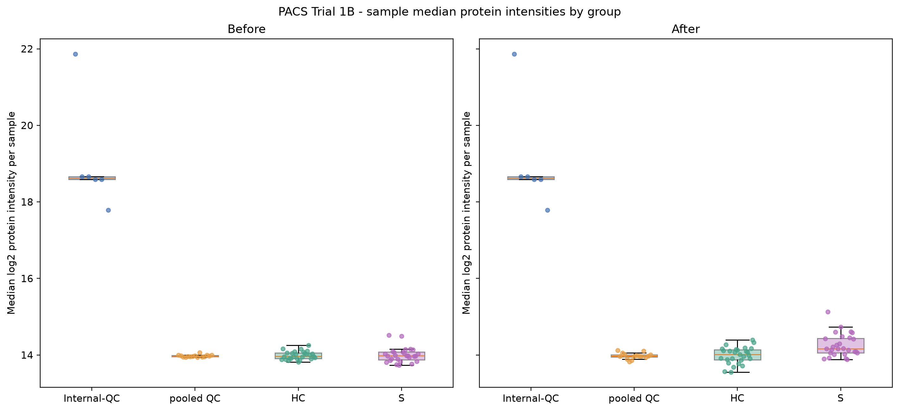
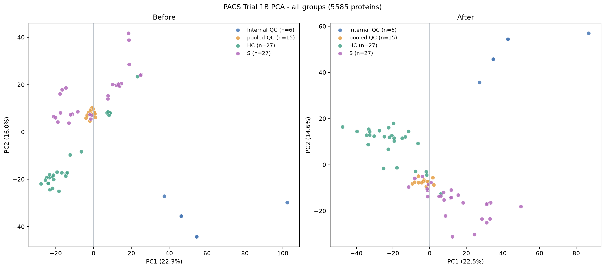
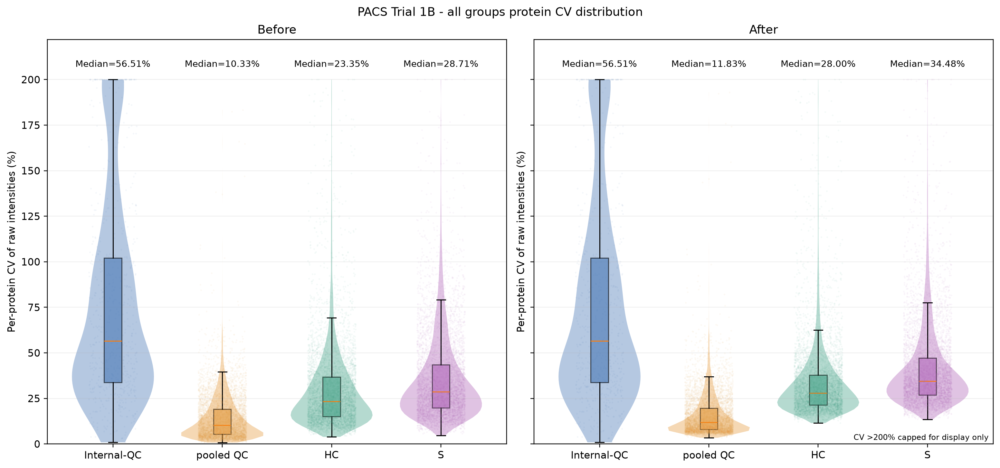
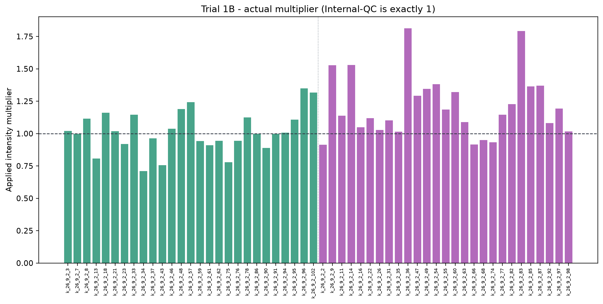
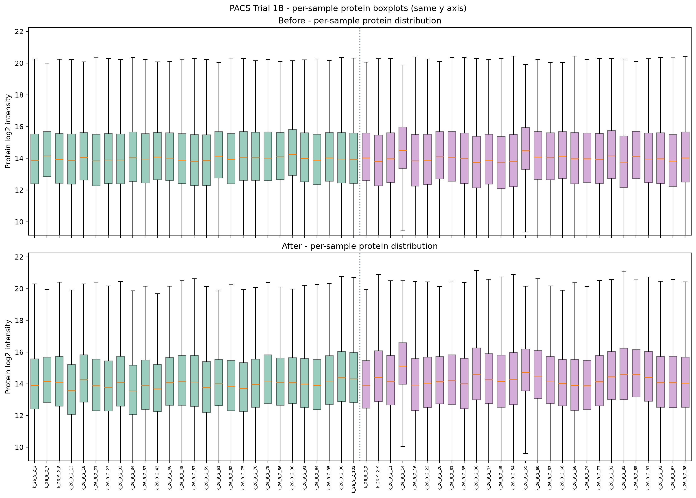
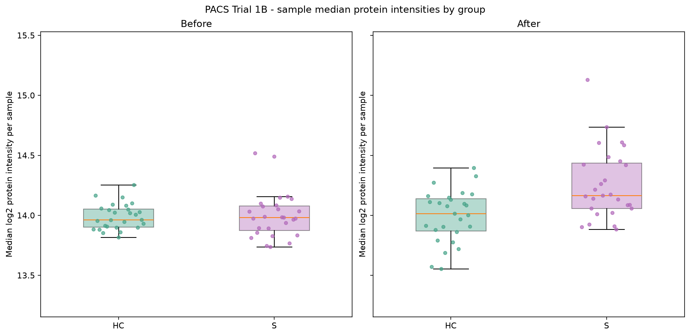
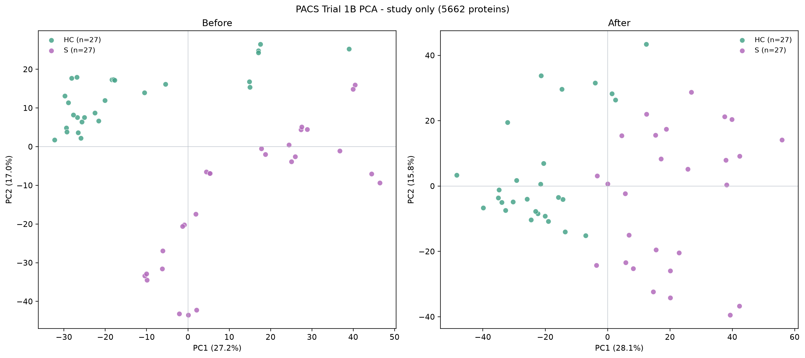
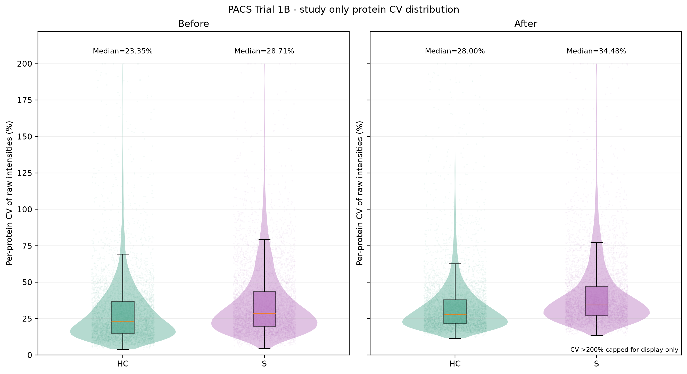

# PACS Trial 1B - Internal-QC remains unchanged

This exploratory test uses the **same division direction** as Trial 1A,
but does NOT correct any Internal-QC (LM) sample. Trial 1A and source files are unchanged.
All generated figures are **PNG only; no SVG**.

## Definition

- For each of the 75 samples, sample_mR = median of valid positive raw L/H ratios for 97 HELP peptides.
- ref_mR = median of the **15 pooled QC sample_mR values**, not a pooled median of individual peptide ratios.
- candidate_factor = sample_mR / ref_mR.
- For pooled QC, HC and S: corrected intensity = original / candidate_factor.
- For Internal-QC: corrected intensity = **original exactly** (applied multiplier = 1).
- LM diagnostic sample_mR and candidate_factor are included in the factor table but NOT applied.
- ref_mR = **0.0193702970409**; corrected matrix includes 6830 protein-group rows × 75 samples.
- n: Internal-QC 6; pooled QC 15; HC 27; S 27.
- The intentional LM_2_1/LM_2_2 and LM_3_2/LM_3_3 duplicates remain as supplied.
- No original pg_matrix.tsv, HELP workbook, metadata or Trial 1A result was edited.

## Two visualization versions

**All groups**: Internal-QC, pooled QC, HC and S (75 samples).
The LM panel/points are identical before and after correction.
**Study only**: HC and S (54 samples), excluding both Internal-QC and pooled QC.
PCA is re-fitted separately for each view; in each view, identical protein
features are used before and after. PCA axes are not directly comparable across views.

### All four groups

### HC and S only

## Per-protein CV summary

CV = sample SD (ddof=1) / mean of positive finite raw protein intensities * 100%.
Only proteins with at least max(3, ceil(70% of group n)) detected
and mean >= 1e-8 have a reported CV; all other CVs are missing, not zero.
There is no CV imputation or log transform; HC/S variation includes biological variation.

| Group | n | CV-eligible proteins | Median before | Median after | Median paired change (pp) |
| --- | ---: | ---: | ---: | ---: | ---: |
| Internal-QC | 6 | 672 | 56.51% | 56.51% | +0.00 |
| pooled QC | 15 | 5966 | 10.33% | 11.83% | +1.80 |
| HC | 27 | 5581 | 23.35% | 28.00% | +4.32 |
| S | 27 | 5822 | 28.71% | 34.48% | +5.76 |

## PCA methodology

- For each view, select protein groups detected in >=70% of samples in that view.
- Retain an identical selected protein feature set across before/after for that view.
- PCA uses log2 positive protein intensities with per-protein median imputation
  of missing log2 values **only for PCA**, separately for before/after.
- Remove invariant protein features, center columns of sample × protein input,
  and do NOT scale individual proteins to unit variance.

| PCA view | Samples | Proteins | PC1 before | PC2 before | PC1 after | PC2 after |
| --- | ---: | ---: | ---: | ---: | ---: | ---: |
| all_groups | 75 | 5585 | 22.33% | 16.00% | 22.46% | 14.60% |
| study_only | 54 | 5662 | 27.16% | 17.00% | 28.08% | 15.77% |

## Outputs

- pg_matrix_corrected.tsv: corrected matrix, LM columns byte-text preserved from the source table.
- normalization_factors.csv: sample medians, candidate factors, applied factors and multipliers.
- per_protein_cv.csv: protein × group CV before and after.
- group_cv_summary.csv: CV statistics for four groups (study-only uses same HC/S rows).
- pca_scores_all_groups.csv and pca_scores_study_only.csv: separate PCA scores.
- pca_explained_variance.csv: protein feature and variance information.
- sample_log2_medians.csv: per-sample box-plot aggregation data for both views.
- figures/all_groups/: 5 PNG figures with four groups.
- figures/study_only/: 5 PNG figures with HC/S only.
- scripts/pacs_trial1b.py and .github/workflows/pacs-trial1b.yml: reproducibility.

## Important caveat

This is a requested exploratory formula, NOT validation of its suitability.
The HELP L/H ratio cannot alone prove that division is the correct correction direction.
No selection or optimization of factor direction has been performed for Trial 1B.
