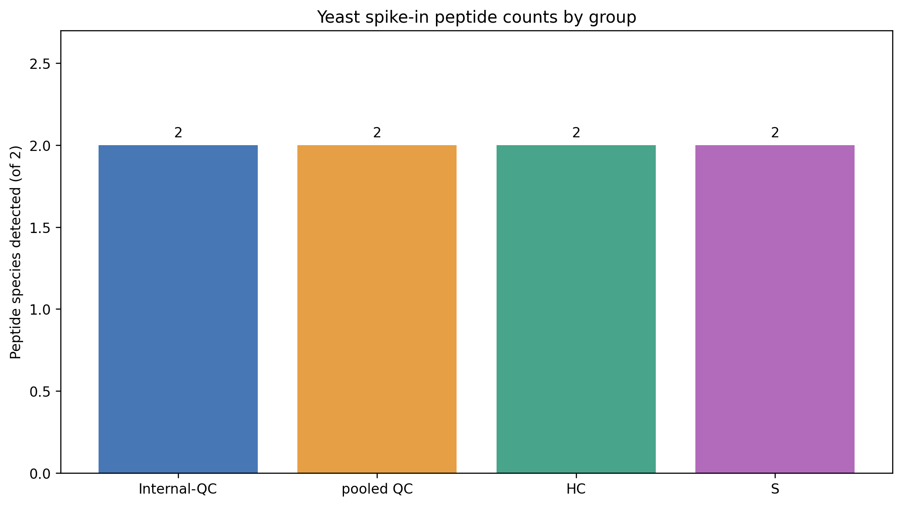
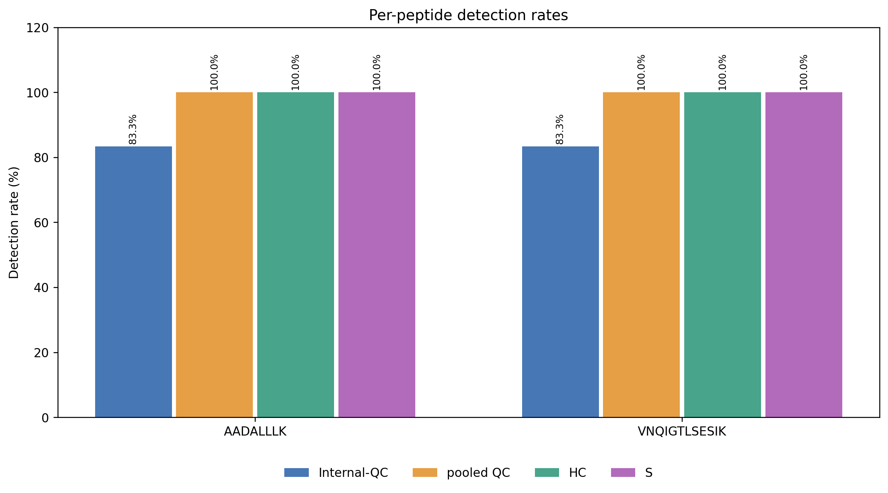
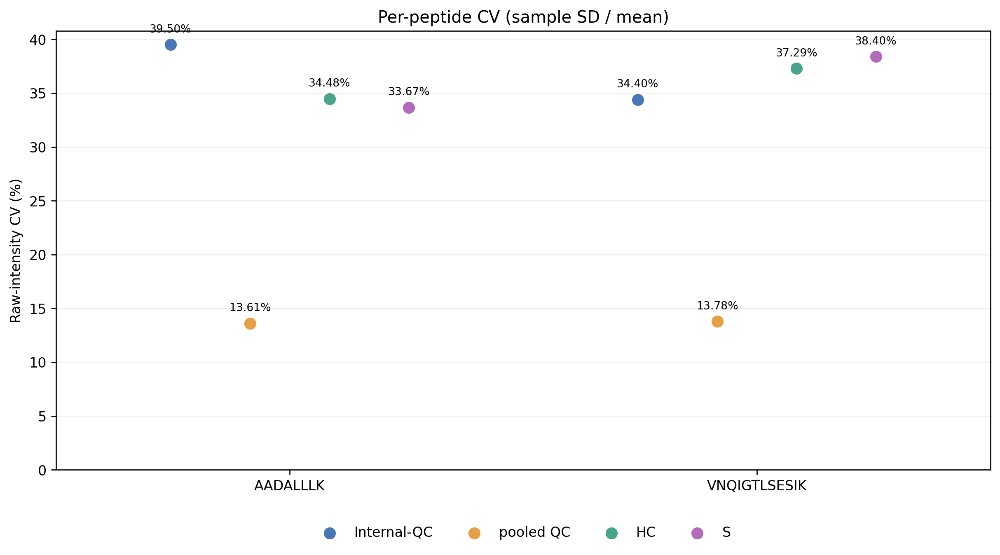
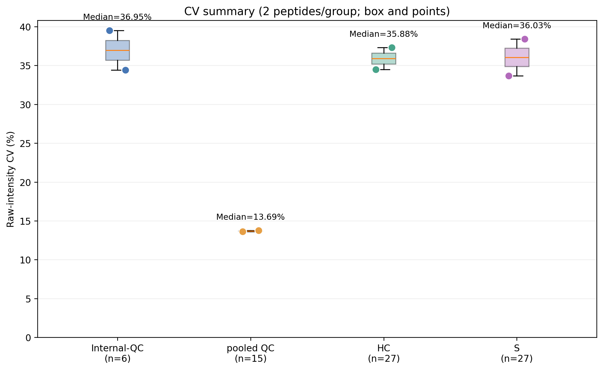

# Yeast spike-in peptide QC

The raw Excel was filtered in place to metadata-listed sample IDs only.
Original sample columns: 109; retained: 75; removed: 34.
Two peptide sequences: AADALLLK, VNQIGTLSESIK.
No intensity normalization, log transform or imputation was performed.

## Detection rates and CV by group

| Peptide | Group | n | Detected | Rate | CV (%) |
| --- | --- | ---: | ---: | ---: | ---: |
| AADALLLK | Internal-QC | 6 | 5 | 83.33% | 39.50 |
| AADALLLK | pooled QC | 15 | 15 | 100.00% | 13.61 |
| AADALLLK | HC | 27 | 27 | 100.00% | 34.48 |
| AADALLLK | S | 27 | 27 | 100.00% | 33.67 |
| VNQIGTLSESIK | Internal-QC | 6 | 5 | 83.33% | 34.40 |
| VNQIGTLSESIK | pooled QC | 15 | 15 | 100.00% | 13.78 |
| VNQIGTLSESIK | HC | 27 | 27 | 100.00% | 37.29 |
| VNQIGTLSESIK | S | 27 | 27 | 100.00% | 38.40 |

## Method

Detected = finite, positive raw intensity. Group rate = detected_n / all group samples * 100.
CV = sample standard deviation (ddof=1) / arithmetic mean * 100 of the positive raw intensities.
As in the attached R script, CV requires at least max(3, ceil(70% * group n)) observations
and mean >= 1e-8. Minimum CV counts: Internal-QC 5/6, pooled QC 11/15, HC 19/27, S 19/27.
Two pairs of Internal-QC columns are intentionally duplicated; nominal n=6 is not independent n=6.
With only two peptides per group, boxplots are descriptive, not stable distribution estimates.

## Figures

Group colors: Internal-QC blue, pooled QC orange, HC green, S purple.

Each figure is available as PNG and SVG.

## CSV outputs

- filtered_intensities.csv: two peptides by 75 samples
- per_peptide.csv: per-peptide, four-group rates/CVs
- per_sample.csv: raw peptide intensities and detection flags
- group_summary.csv: four groups
- excluded_samples.csv: removed sample IDs
