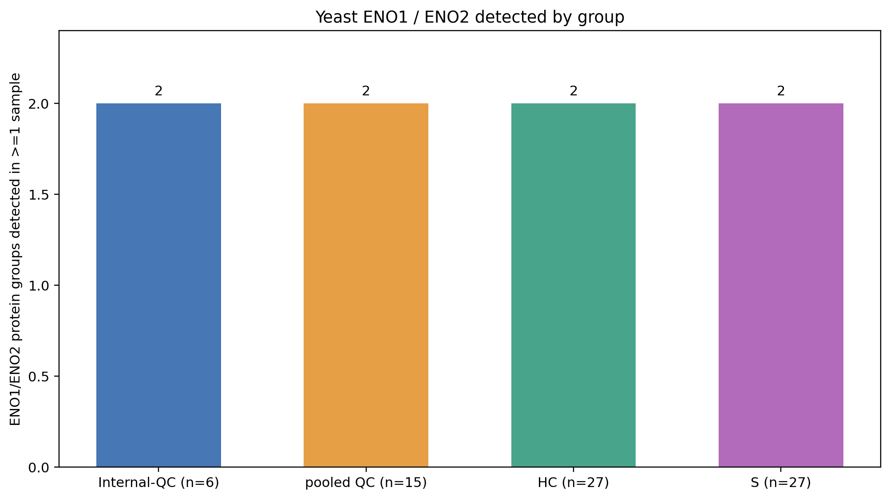
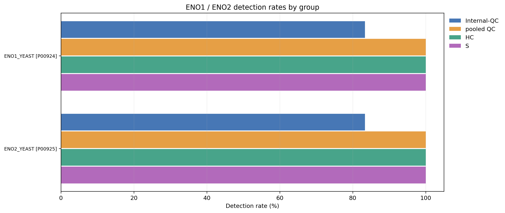
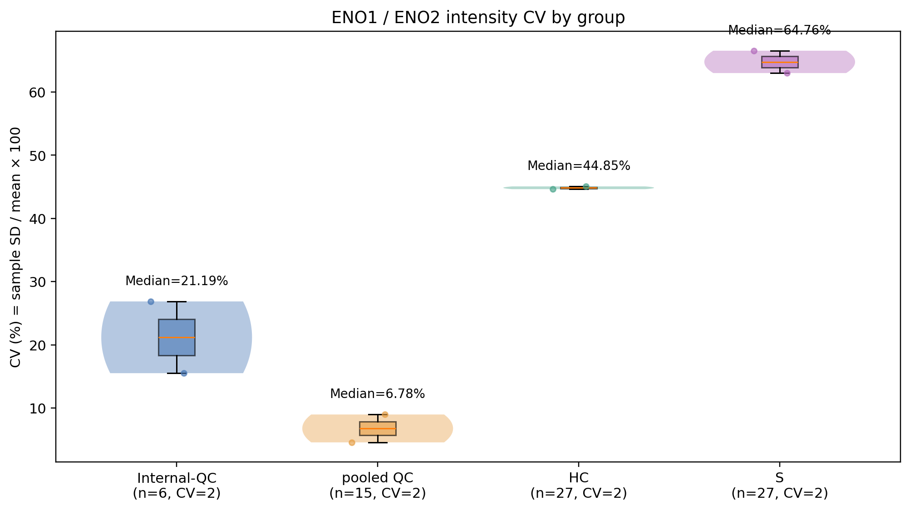
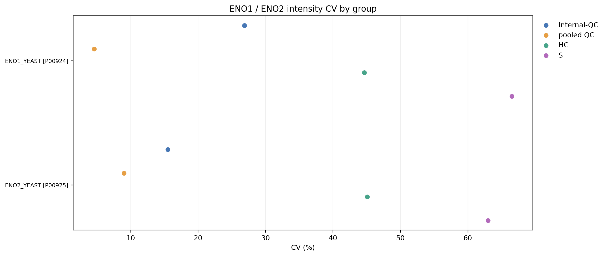
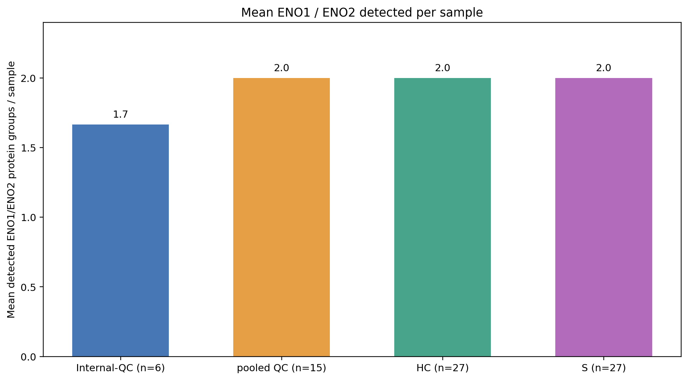
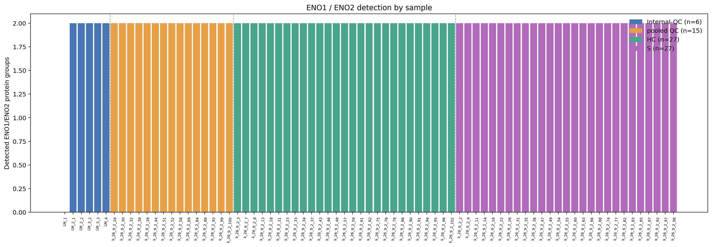
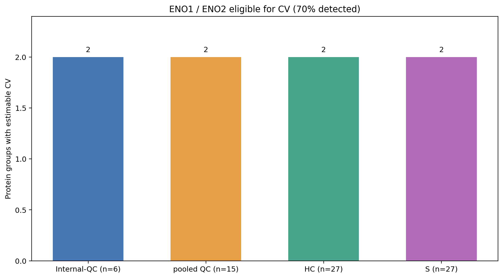

# ENO1 / ENO2 yeast spike-in quality control

Only protein-group rows containing `ENO1_YEAST` or `ENO2_YEAST` as
semicolon-delimited `Protein.Names` tokens are included.
All other yeast and human proteins are excluded.

Data: [pg_matrix.tsv](../../pg_matrix.tsv), [QC metadata](../../all_QC_metadata.xlsx), [study metadata](../../all_sample_metadata.xlsx).
No intensity normalization and no missing-value imputation.

## Four-group summary

| Group | Samples | ENO groups detected (of 2) | Mean detected / sample | CV-estimable ENO groups | Median ENO protein CV (%) |
| --- | ---: | ---: | ---: | ---: | ---: |
| Internal-QC | 6 | 2 | 1.667 | 2 | 21.19 |
| pooled QC | 15 | 2 | 2.000 | 2 | 6.78 |
| HC | 27 | 2 | 2.000 | 2 | 44.85 |
| S | 27 | 2 | 2.000 | 2 | 64.76 |

Here "groups detected" counts target Protein.Group rows with at least one positive, finite intensity in the indicated sample group.
The four group totals can overlap.

## ENO1 and ENO2 separately

| Protein.Names | Group | Detected / n | Detection (%) | CV (%) |
| --- | --- | ---: | ---: | ---: |
| ENO1_YEAST | Internal-QC | 5 / 6 | 83.33 | 26.87 |
| ENO1_YEAST | pooled QC | 15 / 15 | 100.00 | 4.57 |
| ENO1_YEAST | HC | 27 / 27 | 100.00 | 44.63 |
| ENO1_YEAST | S | 27 / 27 | 100.00 | 66.53 |
| ENO2_YEAST | Internal-QC | 5 / 6 | 83.33 | 15.52 |
| ENO2_YEAST | pooled QC | 15 / 15 | 100.00 | 8.98 |
| ENO2_YEAST | HC | 27 / 27 | 100.00 | 45.06 |
| ENO2_YEAST | S | 27 / 27 | 100.00 | 62.99 |

## Definitions

- Detected = finite intensity > 0. Missing, 0, negative and nonfinite values are undetected.
- Detection rate = number detected / **all** samples in group × 100.
- Intensity CV = sample standard deviation (ddof=1) / arithmetic mean × 100, computed on detected **raw** intensities (no log2).
- Following the attached R reference: compute CV only when detected n >= max(3, ceil(0.70 × group sample count)) and mean intensity >= 1e-8. Otherwise CV = NA.
- Minimum detected n for CV: Internal-QC 5/6, pooled QC 11/15, HC 19/27, S 19/27.
- Internal-QC pairs LM_2_1/LM_2_2 and LM_3_2/LM_3_3 are **intentionally duplicated**, so n=6 is nominal rather than six independent values.
- Study-group CV may reflect biological and technical variation.
- One row = one Protein.Group, not necessarily one individually resolved protein; inspect Protein.Names when interpreting identity.

## Visualizations

Group colors throughout: Internal-QC blue, pooled QC orange, HC green, S purple.

PNG and SVG versions are available in `figures/`.

## Downloadable data and reproduction

- [group_summary.csv](group_summary.csv): four-group summary
- [per_protein.csv](per_protein.csv): target protein groups, per-group detection counts/rates/CVs
- [per_sample.csv](per_sample.csv): target-group detections per sample
- [Python script](../../scripts/yeast_protein_qc.py)
- [GitHub Actions workflow](../../.github/workflows/yeast-protein-qc.yml)
